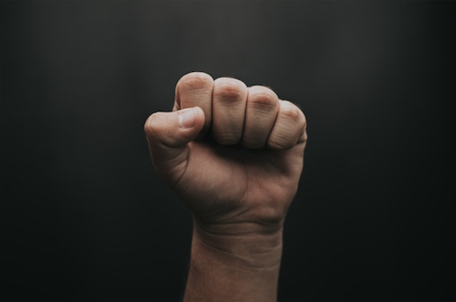
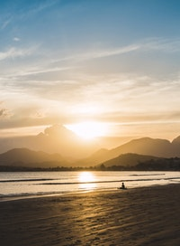
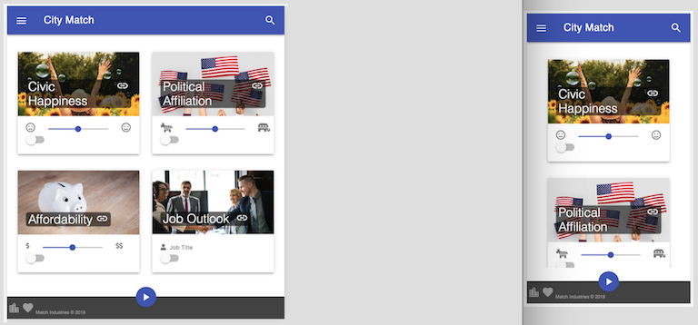
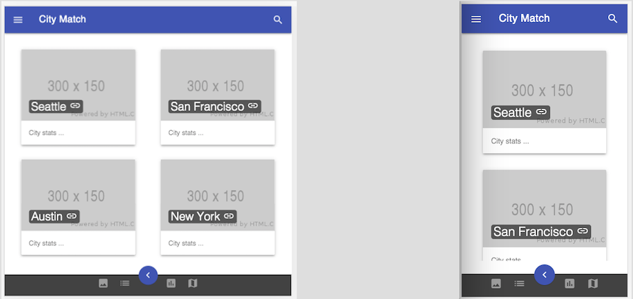
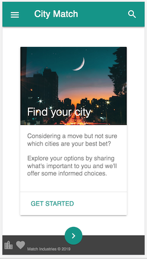

# City Match

Find your city.

# Designer's Log

The Starlight terrace at the Oasis is busy. It's Saturday night which means the music could be rock, soul funk, tribute or a mix. Tonight it's rock.

It's a varied demographic, mostly middle aged married couples getting their groove on with a mix of younger folk watching and enjoying the sunset.

And then he appears.

Early 30's, jean jacket, glasses, long hair, and a red bandana. He calibrates with the band, offering up some fist pumps to the middle-aged rockers.

Later, he approaches the stage and holds up his Bic lighter high in appreciation.

I'm not sure what the band thinks of all this singular devotion. I'm guessing a rush of tipsy soccer mom's would be more their speed, but the point is, this guy has found his tribe and feels he belongs. And isn't that the bottom line?

## Big Data and the Search for Home

Sure, there are instrinsic qualities that allow us to feel comfortable in a variety of environments. But the external world still matters vitally. Scale, economics, culture, community all affect how we relate to and feel about a place. So in a world of options, can big-data expand our awareness and help us find that viable place where we'll feel most at home given our resources?

[City Rank](https://github.com/zenglenn42/CityRank/blob/master/README.md), a 2-week software bootcamp project, explored that idea a bit. However there's only so much that can be done in such a short time.

City Match is an effort to realize the promise of City Rank by improving the user experience with thoughtful front-end design, hardening the code for better performance, and implementing some desired features.

## Thumb Ninja

My focus shifts from the stage to a nearby table where a woman whips out her phone and fluidly navigates through texts and images, powered by the grace of her thumb.

`Tap, tap, swish, scroll. Tap, tap, swish.`

There's an ease and comfort here that seem very natural. I want City Match to be that easy to navigate.

In the morning, I come up with this:

Three screens:

- landing page
- preference page
- results page

all thumb-navigable by a floating action button near the footer. The results page also features multiple views on the same data:

- list view
- image view
- chart view
- map view

On desktop, I could see offering more than one view at a time. But right now, I'm thinking about mobile mostly. That's the plan.

Even though playing with [Material Design components](https://getmdl.io/components/index.html) is a major goal of this UI redesign, I still want to make sure I understand some of the underlying layout tools offered by modern CSS (especially since MDL builds atop some of those tools).

## Flexy FAB Landing Page

Here's my first cut at a pure CSS floating action button centered about the footer edge. This is done with flexbox (to flex the main section and yield a sticky footer), absolute positioning, and a sweet little calc expression to horizontally center the fab at (50% - 1/2 button width). With some SASS variables, I could make this more DRY.

I'll probably employ a media query to limit the max-size of the button on larger viewports, otherwise I get a truncated button. Not horrible, but also not great.

## Grid-based Preference Page

I'll employ some kind of responsive grid layout for the preference slider cards.

My first effort illustrates how grid geometries can easily spill over the available space:

I discover flex-ratio (fr) units and my grid-cells nicely fit to the viewport, preserving ratios:

But with the preference cards that host the sliders, I want something that collapses down to fit at least 1 card width on mobile platforms. I'm thinking auto-fit might be the key. Exploring that next.

## Not a Horrible CSS Grid

After much point, click, and cursing, I have a responsive grid. It also scrolls nicely within its own div so the footer and fab button below that div always stay visible even with a lot of content.

Ruefully, I notice my slider cards often don't fall within thumb range with the current positioning. :-/ But I've burned my layout energy for the day and I'm ready to relax. CSS is an interesting goddess. She enables much, but you have to prove yourself worthy.

[Image](https://flic.kr/p/xWDRiU) courtesy Debansu Saha (by NC-SA-2.0 license).

Oh, btw, I've add some fu to get my fab button to shrink and grow in proportion to the viewport, but with size limiters at both extremes to keep things from getting ridiculous on retina or large displays or smaller devices. City Match on iWatch some day?

## Grid-based Results Page

This is a wholesale grab of the preferences page for the content area, but I tuck a nifty flex row below it for buttons that will control the view on our results data. The buttons will morph to icons in time.

I also subtly tweak the colors to go with my pastel motif. Not sure I'll keep these, but they are more pleasing than what I have above. I basically soften up the header, footer, and fab colors. It's all very Miami. :-)

The cool thing on mobile are the data format buttons. They're in the thumb-zone, so we have a nice usability win here.

Within the flex-ified button div, I use the option:

`justify-content: center;`

with a whisper of left/right button margin for accessibility and proximity to the floating action button (fab).

The layout and styling could use some polish. For example, I feel the button bar cries out for a top-bar of some sort to keep the balance. And maybe that space between the button bar and footer is a slightly odd dead-zone. Could I wedge some monetization in there without be annoying? I could see stacking those two bars and having the fab push the middle option buttons to either side. But I feel I'm in the good enough category at the moment and I want to get some Material Design going and to get this thing /wired up/ to the backend.

The other cool thing is I have more than just wireframes here. I have actual code and behavior that is responsive thanks to the super powers for flexbox and grid. So I could easily hand this off to an awesome designer for them to riff-on and evolve so it's inviting and chock full of affordance.

Photo by Reynaldo Brigantty (#brigworkz)

## Material Design Lite in the House

Here's my first pass at an MDL-based landing page on mobile.

I may switch out the picture for something sunnier, but there are several things I like about the image:

- It's charming!

  - The star filter on the street lights and framing of the crescent moon are almost whimsical.
  - The time-lapse river of orange and yellow is lovely and vibrant.

- The image is not identifiable with any /specific/ city.

  - I want something suggestive that doesn't show bias for a particular city in the landing.
  - That, or have a montage kind of thing of several cities. Possibly a tasteful carousel if it's not too busy.

- [Image](https://www.pinterest.com/pin/742179213570198708/) is courtesy [imageocra](https://www.pinterest.com/imageorca/)

MDL has opinions about stuff ... like color. I'm trying to avoid a bunch of custom colors and simply rely upon defaults like 'primary' for nav bar and fab. Do you notice the footer, by default, is not solid black? Looks like my instinct to lighten my pure CSS footer above aligns with MDL's default sensibilities.

Image courtesy Beto Franklin.

I wake up this morning with a solution for the results page 'dead-zone' under the view buttons. Just stick to my original design on mobile of morphing the footer into a bottom-app bar and let the buttons live in the sticky footer area. Much more pattern-ful, I think. On desktop, I could see having a dedicated results area that floats above the footer and /contains/ the button bar giving better locality of task for larger displays. I'll try to make that happen with some media queries.

The 'list', 'image', 'chart', and 'map' buttons become icons adjacent to the fab on mobile, eliminating that odd dead-space between the gray button-bar and footer on the left.

For now, I want to get the MDL-based preference page cleaned up and doc'd. I'm really enjoying this design exercise probably because it engages very different parts of my brain than my coding-brain. I'm learning a visual vocabulary and getting better at expressing what's in my mind's eye with CSS.

I notice my repo is starting to get cloned, so others must be interested in my exploration as well. (-;

## MDL-based Preferences Page

MDL has a clean look and I'm trying not to clutter it up with background images behind my cards.

Here's the preference 'slider' page. The switches at the bottom of the cards enable & disable preferences users don't care about.

I'll probably add a 'guidance' card at the top that simply invites users to select their preferences. This will provide context and enhance usability by pushing the other sliders closer to the thumb region.

Notice on mobile how the preference card subtly disappears /before/ it hits the floating action button? I think it looks better than tucking behind the button and footer and reduces chance of fat-finger hits between slider and fab button.

Maybe with offscreen preferences (especially on mobile), the fab will remain gray and inactive (or even hidden) until the user scrolls all the way to the bottom of the content just so they don't miss any options before triggering the results pages.

💡It would be easy enough to add a filter for limiting the search to specific states:

With the scrollable preference window, the app scales to an endless array of selectable options.

## MDL-based Results Page

I mock up some results cards and implement the view buttons in the bottom app-bar. I may add text for them as well. I'm using a spacer-button with 'visibility: hidden' in the middle to 'push' the other view buttons away from the floating action button.

I also figure out how to customize the primary and secondary colors on the [MDL site](https://getmdl.io/customize/index.html). So I could come up with more of a teal-based look to match the teal tones in the landing page.

This thing is looking real.

