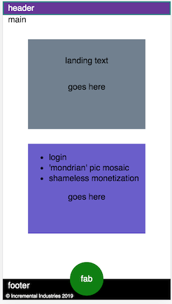
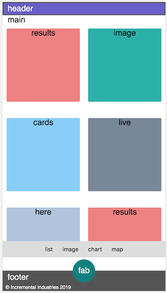
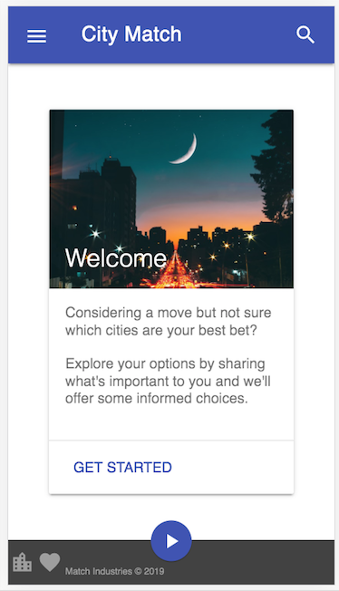
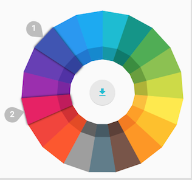
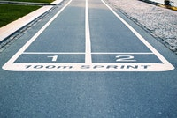
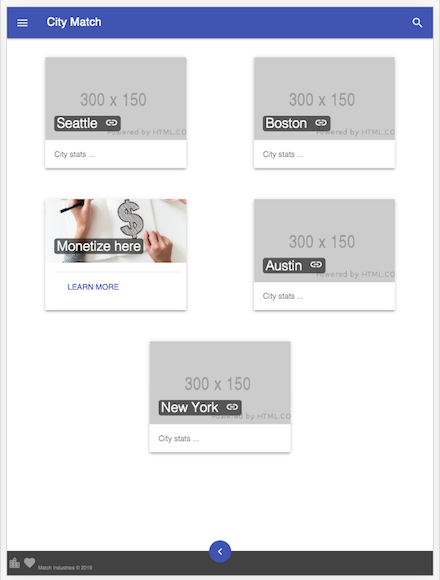
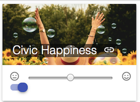

# City Match

Find your city.

# Designer's Log


The Starlight terrace at the Oasis is busy. It's Saturday night which means the music could be rock, soul funk, tribute or a mix. Tonight it's rock.

It's a varied demographic, mostly middle aged married couples getting their groove on with a mix of younger folk watching and enjoying the sunset.

And then he appears.

Early 30's, jean jacket, glasses, long hair, and a red bandana. He calibrates with the band, offering up some fist pumps to the middle-aged rockers.


Later, he approaches the stage and holds up his Bic lighter high in appreciation.

I'm not sure what the band thinks of all this singular devotion. I'm guessing a rush of tipsy soccer moms would be more their speed, but the point is, this guy has found his tribe and feels he belongs. And isn't that the bottom line?

## Big Data and the Search for Home

Sure, there are instrinsic qualities that allow us to feel comfortable in a variety of environments. But the external world still matters vitally. Scale, economics, culture, community all affect how we relate to and feel about a place. So in a world of options, can big-data expand our awareness and help us find that viable place where we'll feel most at home given our resources?

[City Rank](https://github.com/zenglenn42/CityRank/blob/master/README.md), a 2-week software bootcamp project, explored that idea a bit. However there's only so much that can be done in such a short time.

City Match is an effort to realize the promise of City Rank by improving the user experience with thoughtful front-end design, hardening the code for better performance, and implementing some desired features.

## Thumb Ninja

My focus shifts from the stage to a nearby table where a woman whips out her phone and fluidly navigates through texts and images, powered by the grace of her thumb.

`Tap, tap, swish, scroll. Tap, tap, swish.`

There's an ease and comfort here that seem very natural. I want City Match to be that easy to navigate.


In the morning, I come up with this:


Three screens:

- landing page
- preference page
- results page

all thumb-navigable by a floating action button near the footer. The results page also features multiple views on the same data:

- list view
- image view
- chart view
- map view

On desktop, I could see offering more than one view at a time. But right now, I'm thinking about mobile mostly. That's the plan.

Even though playing with [Material Design components](https://getmdl.io/components/index.html) is a major goal of this UI redesign, I still want to make sure I understand some of the underlying layout tools offered by modern CSS (especially since MDL builds atop some of those tools).

## Flexy FAB Landing Page

Here's my first cut at a pure CSS floating action button centered about the footer edge. This is done with flexbox (to flex the main section and yield a sticky footer), absolute positioning, and a sweet little calc expression to horizontally center the fab at (50% - 1/2 button width). With some SASS variables, I could make this more [DRY](https://en.wikipedia.org/wiki/Don%27t_repeat_yourself).

I'll probably employ a media query to limit the max-size of the button on larger viewports, otherwise I get a truncated button. Not horrible, but also not great.



## Grid-based Preference Page

I'll employ some kind of responsive grid layout for the preference slider cards.

My first effort illustrates how grid geometries can easily spill over the available space:


I discover flex-ratio (fr) units and my grid-cells nicely fit to the viewport, preserving ratios:


But with the preference cards that host the sliders, I want something that collapses down to fit at least 1 card width on mobile platforms. I'm thinking auto-fit might be the key. Exploring that next.

## Not a Horrible CSS Grid

After much point, click, and cursing, I have a responsive grid. It also scrolls nicely within its own div so the footer and fab button below that div always stay visible even with a lot of content.


Ruefully, I notice my slider cards often don't fall within thumb range with the current positioning. :-/ But I've burned my layout energy for the day and I'm ready to relax. CSS is an interesting goddess. She enables much, but you have to prove yourself worthy.


[Image](https://flic.kr/p/xWDRiU) courtesy Debansu Saha (by NC-SA-2.0 license).

Oh, btw, I've add some fu to get my fab button to shrink and grow in proportion to the viewport, but with size limiters at both extremes to keep things from getting ridiculous on retina or large displays or smaller devices. City Match on iWatch some day?

## Grid-based Results Page

This is a wholesale grab of the preferences page for the content area, but I tuck a nifty flex row below it for buttons that will control the view on our results data. The buttons will morph to icons in time.

I also subtly tweak the colors to go with my pastel motif. Not sure I'll keep these, but they are more pleasing than what I have above. I basically soften up the header, footer, and fab colors. It's all very Miami. :-)



The cool thing on mobile are the data format buttons. They're in the thumb-zone, so we have a nice usability win here.

Within the flex-ified button div, I use the option:

`justify-content: center;`

with a whisper of left/right button margin for accessibility and proximity to the floating action button (fab).

The layout and styling could use some polish. For example, I feel the button bar cries out for a top-bar of some sort to keep the balance. And maybe that space between the button bar and footer is a slightly odd dead-zone. Could I wedge some monetization in there without be annoying? I could see stacking those two bars and having the fab push the middle option buttons to either side. But I feel I'm in the good enough category at the moment and I want to get some Material Design going and to get this thing /wired up/ to the backend.

The other cool thing is I have more than just wireframes here. I have actual code and behavior that is responsive thanks to the super powers for flexbox and grid. So I could easily hand this off to an awesome designer for them to riff-on and evolve so it's inviting and chock full of [affordance](https://sites.google.com/site/thedesignofeverydaythings/home/affordances).


Photo by Reynaldo Brigantty (#brigworkz)

## Material Design Lite in the House

Here's my first pass at an MDL-based landing page on mobile.



I may switch out the picture for something sunnier, but there are several things I like about the image:

- It's charming!

  - The star filter on the street lights and framing of the crescent moon are almost whimsical.
  - The time-lapse river of orange and yellow is lovely and vibrant.

- The image is not identifiable with any /specific/ city.

  - I want something suggestive that doesn't show bias for a particular city in the landing.
  - That, or have a montage kind of thing of several cities. Possibly a tasteful carousel if it's not too busy.

- [Image](https://www.pinterest.com/pin/742179213570198708/) is courtesy [imageocra](https://www.pinterest.com/imageorca/)

MDL has opinions about stuff ... like color. I'm trying to avoid a bunch of custom colors and simply rely upon defaults like 'primary' for nav bar and fab.



Do you notice the footer, by default, is not solid black? Looks like my instinct to lighten my pure CSS footer above aligns with MDL's default sensibilities.


Image courtesy Beto Franklin.

I wake up this morning with a solution for the results page 'dead-zone' under the view buttons. Just stick to my original design on mobile of morphing the footer into a bottom-app bar and let the buttons live in the sticky footer area. Much more pattern-ful, I think. On desktop, I could see having a dedicated results area that floats above the footer and /contains/ the button bar giving better locality of task for larger displays. I'll try to make that happen with some media queries.

The 'list', 'image', 'chart', and 'map' buttons become icons adjacent to the fab on mobile, eliminating that odd dead-space between the gray button-bar and footer on the left.


For now, I want to get the MDL-based preference page cleaned up and doc'd. I'm really enjoying this design exercise probably because it engages very different parts of my brain than my coding-brain. I'm learning a visual vocabulary and getting better at expressing what's in my mind's eye with CSS.

I notice my repo is starting to get cloned, so others must be interested in my exploration as well. (-;

## MDL-based Preferences Page

MDL has a clean look and I'm trying not to clutter it up with background images behind my cards.

Here's the preference 'slider' page. The switches at the bottom of the cards enable & disable preferences users don't care about.


I'll probably add a 'guidance' card at the top that simply invites users to select their preferences. This will provide context and enhance usability by pushing the other sliders closer to the thumb region.

Notice on mobile how the preference card subtly disappears /before/ it hits the floating action button? I think it looks better than tucking behind the button and footer and reduces chance of fat-finger hits between slider and fab button.

Maybe with offscreen preferences (especially on mobile), the fab will remain gray and inactive (or even hidden) until the user scrolls all the way to the bottom of the content just so they don't miss any options before triggering the results pages.

💡It would be easy enough to add a filter for limiting the search to specific states:


With the scrollable preference window, the app scales to an endless array of selectable options. For minimal viable product (MVP), I'll stick to the 4 preferences I have above. Once the VC clears, all sorts of scalability plays can happen. (-;

## MDL-based Results Page


I mock up some results cards and implement the view buttons in the bottom app-bar. I may add text for them as well. I'm using a spacer-button with 'visibility: hidden' in the middle to 'push' the other view buttons away from the floating action button.

I also figure out how to customize the primary and secondary colors on the [MDL site](https://getmdl.io/customize/index.html). So I could come up with more of a teal-based look to match the teal tones in the landing page.


This thing is looking real.


## Onto the Controller

I need to bring up a controller that listens for button clicks and switches page views. But I'm blocked. My mojo is just not here today. I've been working at this pretty hard for the past week and I need a break. The UI design is in good shape and with fresh eyes, I'm hopeful the controller will emerge in the fullness of time.

## Turning the Page


Photo by Pixabay

I've come to a decision on my HTML. This is a relatively small app from a front-end perspective and I could just inline all 3 pages worth of HTML and maybe do the whole jQuery _.hide() / _.show() thing for each page-level div.

But there is a /lot/ of repetition in the markup with MDL cards that only differ in a few attributes. Seems a safe bet to either use templates or programmatically generate the content with parameterized helper functions.
In fact, this is essential for scalability of preference options and dynamically generated results.

Though I want to improve my vanilla javascript chops, I think I will lean on my frenemy, jQuery, since he has some ready idioms for enabling event delegation to dynamically created DOM children with buttons and sliders and such. Maybe as a-post MVP exercise, I may redo this in pure js since I know it's good for me.

With that decision out of the way, I can focus on the primitives I'll need to build out the HTML dynamically.


Photo by Tim Gouw

Ok, that was not bad at all. My HTML is [dynamic](https://github.com/zenglenn42/CityMatch/blob/a1c9c0ffeb00ef0bb0e6165ea914a683f56984b5/assets/js/controller.js#L2). That means the body of my html is blissfully uncluttered:

```
  <body>
    <div
      id="body-div"
      class="mdl-layout mdl-js-layout mdl-layout--fixed-header"
    >
      <!-- programmatically add content here -->
    </div>

    <script type="text/javascript">
      controller = new Controller("body-div");
    </script>
  </body>
```

Now I need to wire up the buttons.

But before that, a non-linear thought from a previous conversation wells up.

## Monetization

Could this thing generate ad revenue?

I'm thinking about:

- Movers
- Realtors
- Apartment locators
- Job recruiters
- Major employers
- Educational institutions

With some stylistic guidelines, such monetization cards could be blended into the output without looking horrible:



More subtly, the monetization cards could be auctioned off in real-time, calibrated to the demographic data implied by the user's preferences, particularly affordability. Is that evil or brilliant? [Discuss](https://en.wikipedia.org/wiki/Coffee_Talk).

I need to get this thing generating hit metrics if I go down that path.

Beyond that, I fix a few regressions caused by my flurry of coding yesterday in the rush toward dynamic HTML.
I also wire up the fab buttons and deploy to [github-pages](https://zenglenn42.github.io/CityMatch/) so you can at least advance the prototype between landing, preferences, and results pages (though I see my fancy enable checkboxes on pref cards have reverted to simple checkboxes and the hamburger menu only works on the landing page, bah). Overall, it has been a good day.

## Dynamic HTML decorated with MDL classes is a Thing


Photo by Tim Mossholder

I'm still dealing with the fallout from generating my HTML on the fly with javascript. Strangely, event delegation to the hamburger menu works for my first dynamically created page, but fails for subsequent pages. In plain English, the menu doesn't do anything when I click on it for the preference and results pages.

The other issue is my spiffy MDL-styled checkboxes are no longer styled. And even more annoying, the active region for the unstyled checkbox extends for the length of the card,
creating all sorts of opportunities for trying to tap the slider but getting the enable /
disable toggle.

So I need to slow down and fix stuff and maybe actually read the docs on dynamic MDL. :-/

### Unpacking MDL Switches

So I want this MDL-styled switch on my preference cards:


but I'm getting /this/:


And sure enough, if you look at the underlying HTML, you see:

```
<label class="mdl-switch mdl-js-switch mdl-js-ripple-effect" for="switch-civic-happiness">
  <input type="checkbox" id="switch-civic-happiness" class="mdl-switch__input">
</label>
```

whereas on a properly formed MDL switch, you should see:

```
<label
  class="mdl-switch mdl-js-switch mdl-js-ripple-effect mdl-js-ripple-effect--ignore-events is-upgraded"
  for="switch-civic-happiness"
  data-upgraded=",MaterialSwitch,MaterialRipple"
>
  <input type="checkbox" id="switch-civic-happiness" class="mdl-switch__input"/>
  <div class="mdl-switch__track"></div>
  <div class="mdl-switch__thumb">
    <span class="mdl-switch__focus-helper"></span>
  </div>
  <span
    class="mdl-switch__ripple-container mdl-js-ripple-effect mdl-ripple--center"
    data-upgraded=",MaterialRipple"
    ><span class="mdl-ripple"></span></span>
</label>
```

All that missing HTML is normally added behind the scenes by MDL's javascript when the abstract representation of the HTML is loaded into the document object model (DOM).

However, with dynamically generated HTML, I'm downstream of any "document-loaded" event and am missing out on that essential MDL "upgrade" that happens to the stock checkbox HTML.

Fortunately, MDL provides a utility function for this case:

```
componentHandler.upgradeElement(checkbox);
```

The usage pattern is more like this:

```
/* DOM already loaded.  About to create dynamically generated checkbox. */

let checkbox = createCheckbox(id, isChecked);
checkbox.setAttribute("class", "mdl-switch__input");

/* Enhance checkbox with MDL-styling. */
componentHandler.upgradeElement(checkbox);
```

Now my dynamically-generated preference cards feature MDL-styled enable switches like they used to when the HTML was static:



As with most things in life, the [actual fix](https://github.com/zenglenn42/CityMatch/commit/fd5a32d5ac4b09d9bb6a3467424ec1041fb8771e#diff-453a0b065c3a1e8636126a44b38d9f55R35) is a little more involved than what has been advertised. He who carries the bag, knows what's inside.

### [Fix IT!](https://tenor.com/view/fix-it-snl-oscar-rogers-weekend-update-kenan-thompson-gif-10667500) (the unresponsive hamburger menu)

I jump into the chrome debugger and bring up sources and enable mouse-click event listener breakpoints, hoping that will give me a meaty clue in the working case of which method /should/ be firing and leverage that to search the web.


```
MaterialLayout.prototype.drawerToggleHandler_ = function(evt) {...}
```

Ah, the toggle handler fires on the landing page, but /not/ preferences and results pages.
The gift economy of [stackoverflow](https://stackoverflow.com/questions/35672757/dynamically-adding-mdl-nav-drawer) comes through for me thanks to Krishna Santosh Nidri.

With this [fix](https://github.com/zenglenn42/CityMatch/commit/9d0e6c28ac27b1b4ca5e3c412f5bbbe4a96b01e5) in place, serenity is restored and I can think about adding event listeners to other user-interaction elements.


Photo by Simon Migaj

## [Machine Learning](https://work.caltech.edu/telecourse) Play?

I've watched friends and family play with City Rank and in some cases they're delighted. "Oh, I /do/ like that city!" And in other cases, not so much. "That town is a stretch for me."

Obviously there is complexity in what matters to someone. The current preference sliders (happiness index, political affiliation, affordability) are interesting and help narrow the field, but it would be difficult to anticipate all the inputs that matter. (One mom wanted a city with driveways that were not too steep. :-/)


Photo by Pixabay

My question: Is there a way to tap into the collective wisdom (or more darkly, the biases) of the crowd by adding a 'like' button on each city card in the results section, essentially capturing preference data not anticipated by the finite number of input preferences? Out of this set of 10 results, humanity tends to favor /this/ subset ... kinda thing.

Such preference data would certainly help with monetization and ad targeting.

Obviously ML is probably not for MVP, but something in the back of my mind. The 'like' button, on the other hand, is low hanging fruit. ♥
